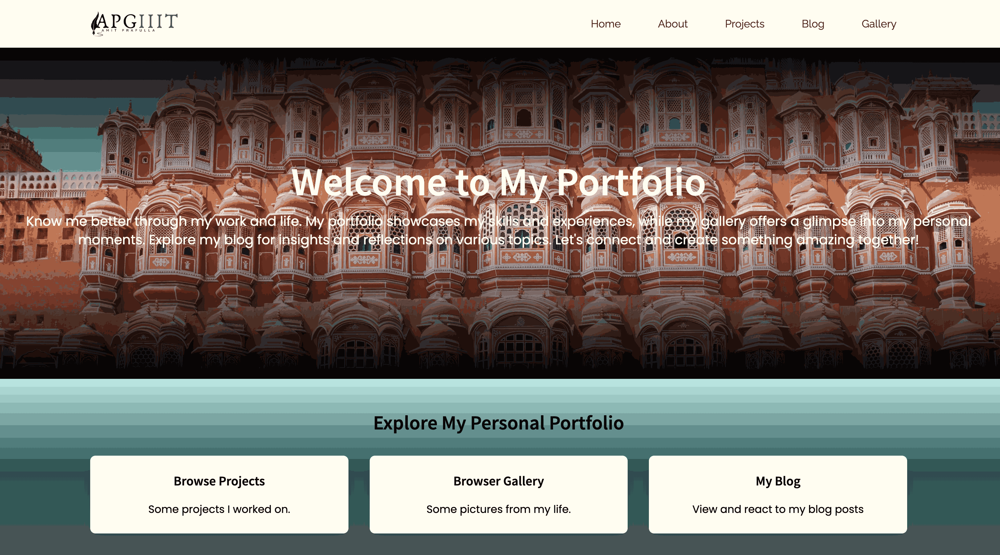

# Svelte Kit Portfolio




## About the Project

Svelte Kit Portfolio is a personal portfolio website built with SvelteKit, TailwindCSS, and TypeScript. It showcases posts, a gallery, and projects in a clean and responsive design. The project is designed to highlight my work and provide visitors with an engaging experience.

## Screenshots

Please find some of the screenshots of the portfolio below.


## SSR - When to render on client and when on server?

Server-side rendering (SSR) is used strategically in this project:

- **Render on the server** for static content like posts, project details, and gallery items to ensure SEO optimization and fast initial load times.
- **Render on the client** for dynamic interactions such as filtering posts, navigating the gallery, or submitting contact forms.

By leveraging SSR and client-side rendering effectively, the portfolio achieves a balance between performance and interactivity.

### Features
- Showcase posts with titles, descriptions, and tags.
- Display a gallery of images with a responsive layout.
- Highlight projects with detailed descriptions and links.
- Fully responsive design for desktop and mobile devices.
- Built-in Svelte store is used for state management, it only calls API for the first time. Then, it uses data from the store.

### Technologies Used
- **SvelteKit**: A modern framework for building fast and scalable web applications.
- **TailwindCSS**: A utility-first CSS framework for styling.
- **TypeScript**: A strongly typed programming language for better code quality and maintainability.

### Getting Started
To run the project locally, follow these steps:
1. Clone the repository:
    ```bash
    git clone https://github.com/apfirebolt/svelte-kit-portfolio.git
    ```
2. Navigate to the project directory:
    ```bash
    cd svelte-kit-portfolio
    ```
3. Install dependencies:
    ```bash
    npm install
    ```
4. Start the development server:
    ```bash
    npm run dev
    ```
5. Open your browser and navigate to `http://localhost:8080`.

### Contributing
Contributions are welcome! Feel free to open an issue or submit a pull request.

### License
This project is licensed under the MIT License. See the `LICENSE` file for details.
